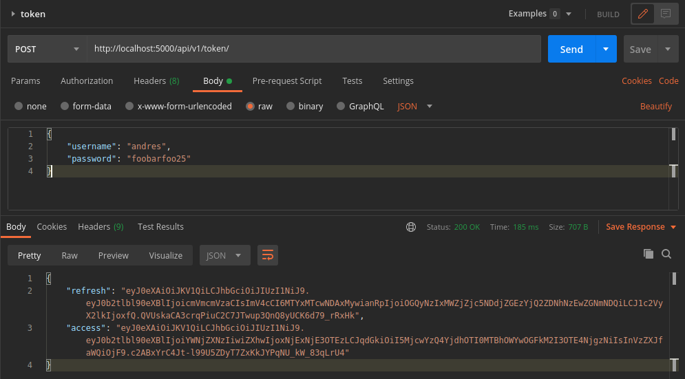
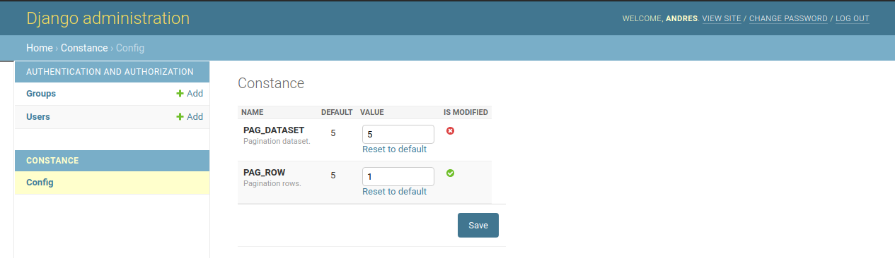
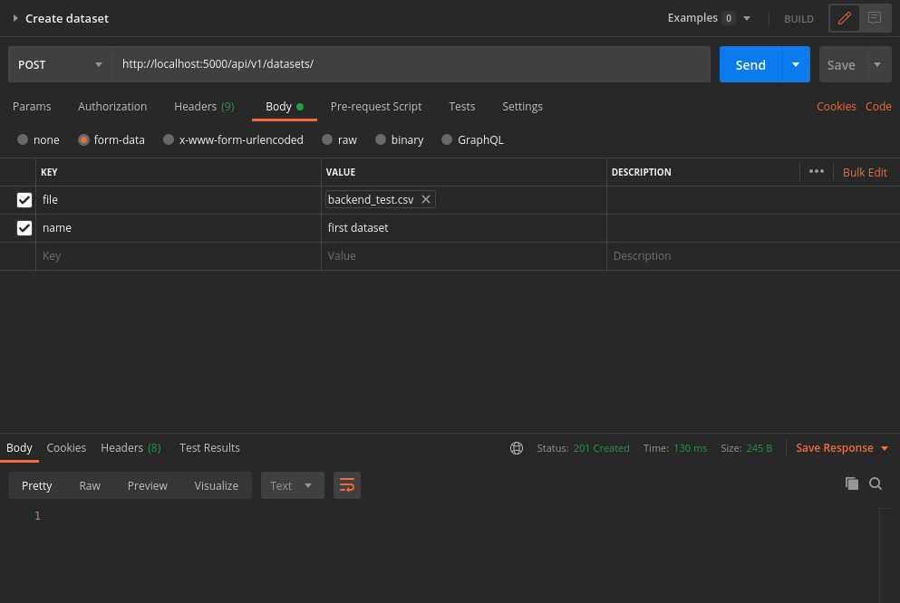
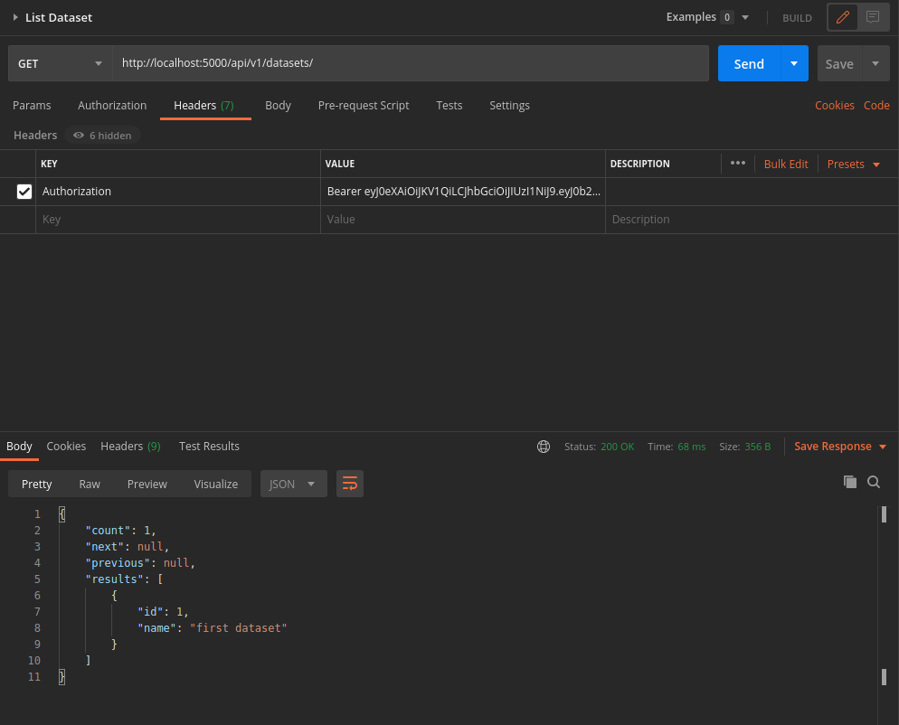
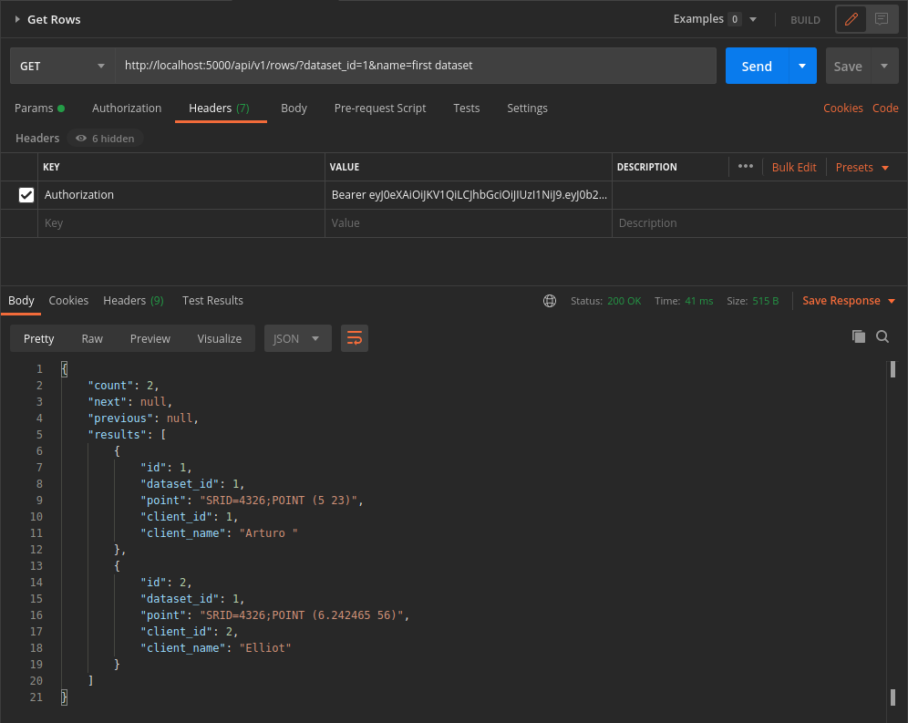
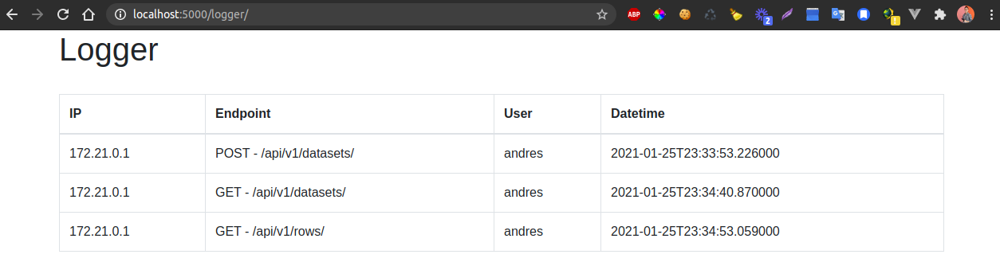

# TEST DJANGO DOCS
In this project I use any tools, these are:
* Git
* Git flow
* Docker
* Docker compose
* Curl's postman

#### Deploy
Add a `docker-compose.yml` and `Dockerfile` files, in this file 
start container for data base and server django. This for local test.

Any tasks in the file: 
* Create data base
* Migrate models django app
* Start server in the `0.0.0.0:5000` 

For local test execute the next command:

```
docker-compose up 
```

#### Architecture
This project is designed as Microservices, the project
has the next architecture:
```
- config            # This folder containt all projects settings
- common            # Containt any helpers for project e.g: validations, mocks, etc.
- core              # Is the initial app
    - managers      # Custom querys for each model 
    - models        # Custom models 
    - serializers   # Custom serializers for each model 
    - services      # Custom services for each model
    - test          # Custom test for each component e.g: services, managers, views
    - views         # Custom views for each model
    - urls          # Custom urls for each model
- docker-compose.yml # Custom deploy in local for test
- Dockerfile
``` 


#### Local deploy 
Use the next body for login: 
```
{
    "username": "andres",
    "password": "foobarfoo25"
}
```

This user is used too in admin django.



#### Constance
I use constance for change variable from admin django.


#### Create dataset 
###### Curl 
```
curl --location --request POST 'http://localhost:5000/api/v1/datasets/' \
--header 'Authorization: Bearer ACCESS_TOKEN' \
--form 'file=@"~/backend_test.csv"' \
--form 'name="first dataset"'
```
######  Response



#### List Dataset
###### Curl 
```
curl --location --request GET 'http://localhost:5000/api/v1/datasets/' \
--header 'Authorization: Bearer ACCESS_TOKEN'
```
######  Response


#### Get Rows
###### Curl 
```
curl --location --request GET 'http://localhost:5000/api/v1/rows/?dataset_id=1&name=first%20dataset' \
--header 'Authorization: Bearer ACCESS_TOKEN'
```
######  Response


#### Logger
###### Curl 
```
curl --location --request GET 'http://localhost:5000/logger/' \
```
######  Response


